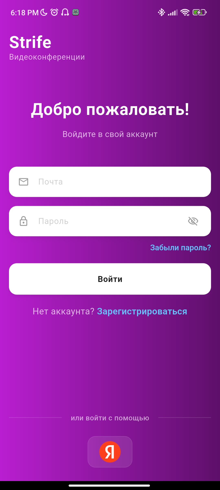
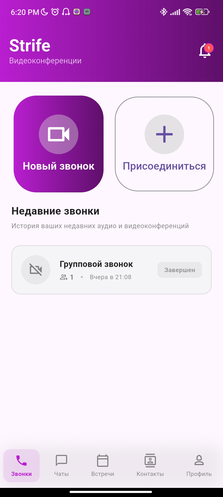
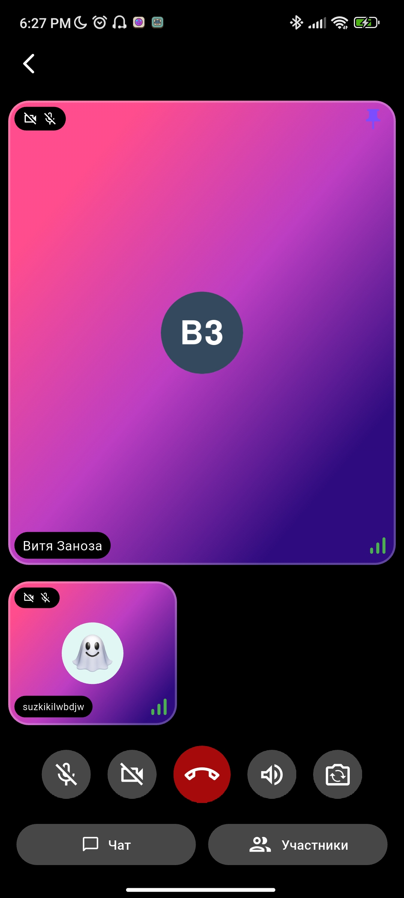
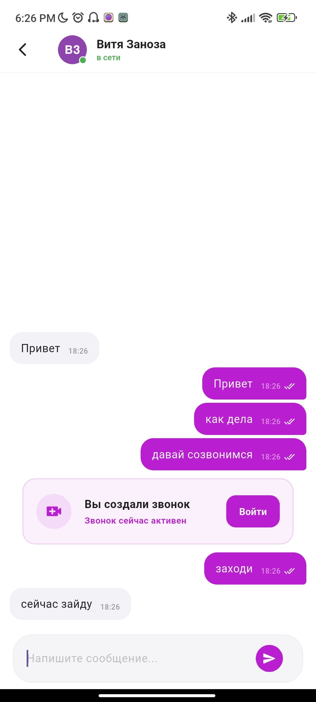
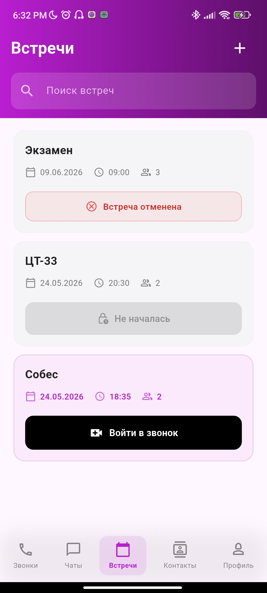
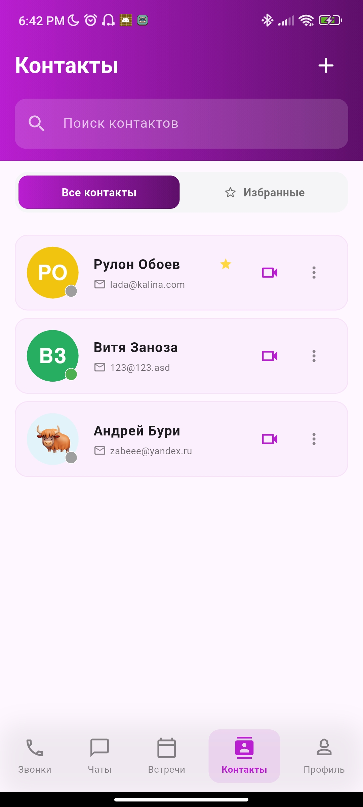
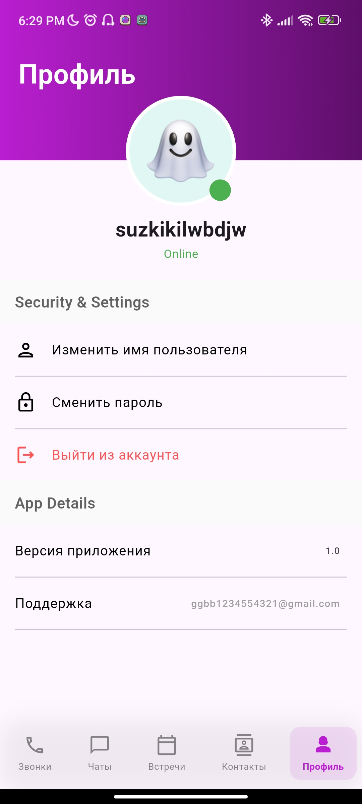
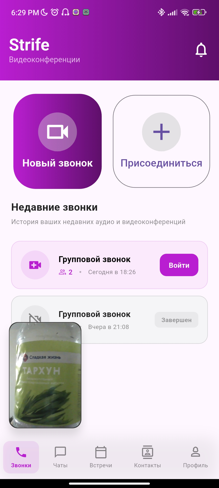

# Strife

<p align="center">
  
</p>

<h1 align="center">Strife</h1>

<p align="center">
  <strong>A modern cross-platform video conferencing application built with Flutter</strong>
</p>

<p align="center">
  
  
  
  
  
  
</p>

---

## ✨ Overview

**Strife** is a cross-platform mobile video conferencing application developed as an educational project using **Flutter**, **Firebase**, and **LiveKit**.

The application provides a complete communication ecosystem with:
- Real-time video calls
- Messaging
- Meeting scheduling
- Contact management
- Push notifications
- Deep linking support
- Modern animated UI

> ⚠ This project is currently under active development and is intended for educational purposes only.

---

# 📱 Features

## 🔐 Authentication
- Email & password sign in
- User registration with automatically generated avatars
- Yandex ID OAuth authentication
- Password reset support

## 📞 Video Conferencing
- Create and manage video calls
- Join calls using room IDs
- Host controls and participant management
- Camera and microphone toggles
- Transfer host permissions
- Remove participants from calls
- End meeting for all participants
- Share invite links using deep links
- Call history with statuses and timestamps
- Picture-in-Picture (PiP) mode
- Adaptive participant grid layout
- Connection quality indicators
- Participant pinning support

## 💬 Chats
- Private real-time chats
- Read status indicators
- Call invitations directly inside chats
- Chat search functionality
- Online/offline presence tracking

## 📅 Meetings
- Schedule meetings for specific dates and times
- Invite participants during creation
- Push notification reminders
- Meeting editing and cancellation
- Join meetings directly from cards

## 👥 Contacts
- Add contacts via email
- Friend request system
- Favorites support
- Remove contacts
- Contact search
- Quick video calls from contacts

## 👤 User Profile
- Change display name
- Password management
- Online/offline status
- Secure logout

## 🔔 Notifications
- Firebase Cloud Messaging integration
- Local notifications with avatars
- Notification center inside the app
- Unread notification counters
- Multiple notification types:
  - Friend requests
  - Call invitations
  - Messages
  - Meeting reminders
  - Meeting updates

## 🎨 UI / UX
- Custom purple gradient theme
- Smooth page transitions and animations
- Adaptive responsive design
- Custom animated toast notifications
- Animated PiP transitions

---

# 🛠 Tech Stack

| Category | Technologies |
|----------|--------------|
| Framework | Flutter 3.9+ |
| Language | Dart |
| Backend | Node.js |
| Video Communication | LiveKit |
| Database | Cloud Firestore, Firebase Realtime Database |
| Authentication | Firebase Auth, Yandex OAuth |
| Notifications | Firebase Cloud Messaging, flutter_local_notifications, gorush |
| State Management | flutter_bloc, Provider |
| Deep Links | app_links, url_launcher |
| UI & Animations | animations, bot_toast |
| Platforms | Android, Web |

---

# 🏗 Architecture

The project follows **Clean Architecture** principles combined with the **BLoC** state management pattern.

```text
lib/
├── data/
│   ├── models/
│   └── repositories/
├── firebase/
├── presentation/
│   └── blocs/
├── themes/
└── ui/
    ├── views/
    └── widgets/
```

### State Management
- **BLoC** — business logic and state handling
- **Provider** — dependency injection
- **Streams** — real-time synchronization with Firebase

### Navigation
- `PageView` with bottom navigation
- Centralized navigation using `NavigationBloc`

---

# 🔗 Deep Linking

Strife supports custom deep links for direct room joining.

```text
strife://room?id={room_id}
```

When the application is installed, opening the link automatically redirects the user into the corresponding video call.

---

# 🖥 Backend Structure

```text
backend
├── gorush-not
│   └── config.yml
├── index.js
└── routes
    ├── auth.js
    ├── avatar.js
    ├── livekit.js
    ├── notifications.js
    └── user.js
```

---

# 📸 Screenshots

| Login | Home | Video Call |
|------|------|------------|
|  |  |  |

| Chats | Meetings | Contacts |
|------|-----------|----------|
|  |  |  |

| Notifications | Profile | PiP Mode |
|---------------|---------|----------|
|  |  |  |

---

# 🚀 Getting Started

## Prerequisites

Before running the project, make sure you have:

- Flutter SDK 3.9.2 or newer
- A Firebase project
- A configured LiveKit server

---

## ⚠ Required Configuration Files

The following files are NOT included in the repository and must be provided manually:

```text
lib/firebase/firebase_options.dart
android/app/google-services.json
ios/Runner/GoogleService-Info.plist
```

Generate Firebase configuration using:

```bash
flutterfire configure
```

You can obtain Firebase credentials from the Firebase Console.

---

# 📦 Installation

## 1. Clone the repository

```bash
git clone https://github.com/suzkikilwbdjw/strife.git
cd strife
```

## 2. Install dependencies

```bash
flutter pub get
```

## 3. Configure Firebase

```bash
flutterfire configure
```

## 4. Add Firebase configuration files

Place:
- `google-services.json`
- `GoogleService-Info.plist`

into the appropriate platform directories.

## 5. Run the application

```bash
flutter run
```

---

# 🏗 Build

## Android APK

```bash
flutter build apk --release
```

## Web

```bash
flutter build web
```

---

# 📋 Roadmap

- [ ] Group chats
- [ ] Image and file sharing
- [ ] Call recording
- [ ] Virtual backgrounds
- [ ] Dark mode

---

# 📄 License

This project was created for educational purposes.

No license is currently specified.